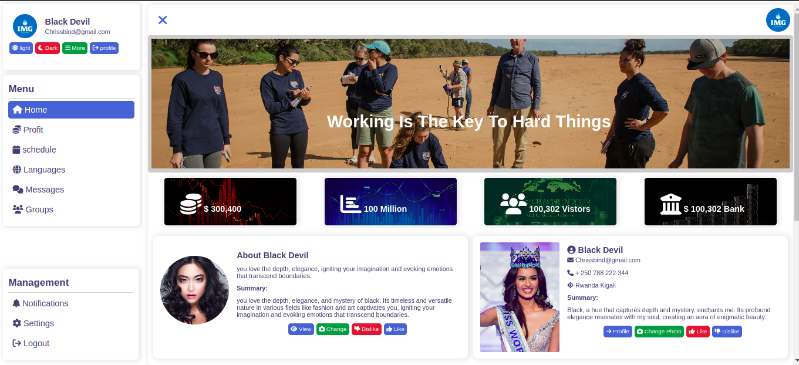
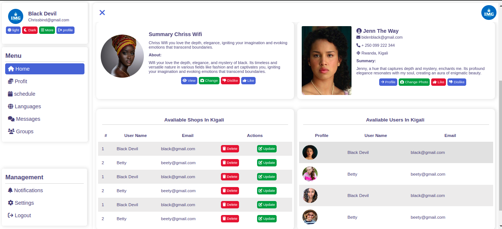
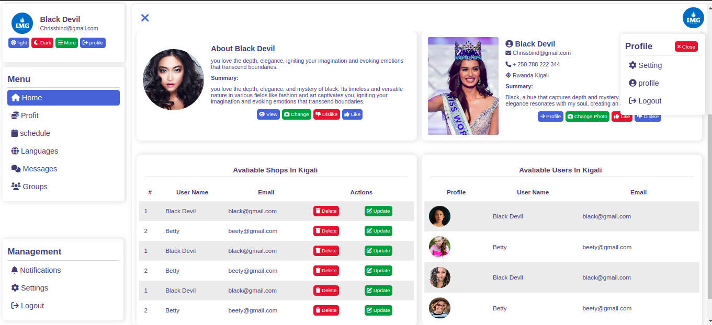
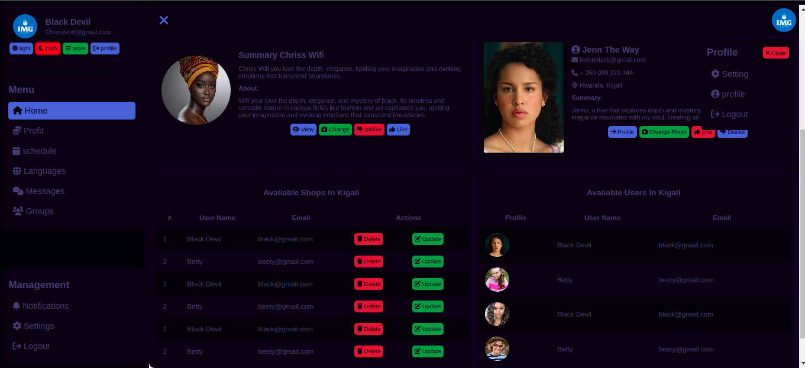
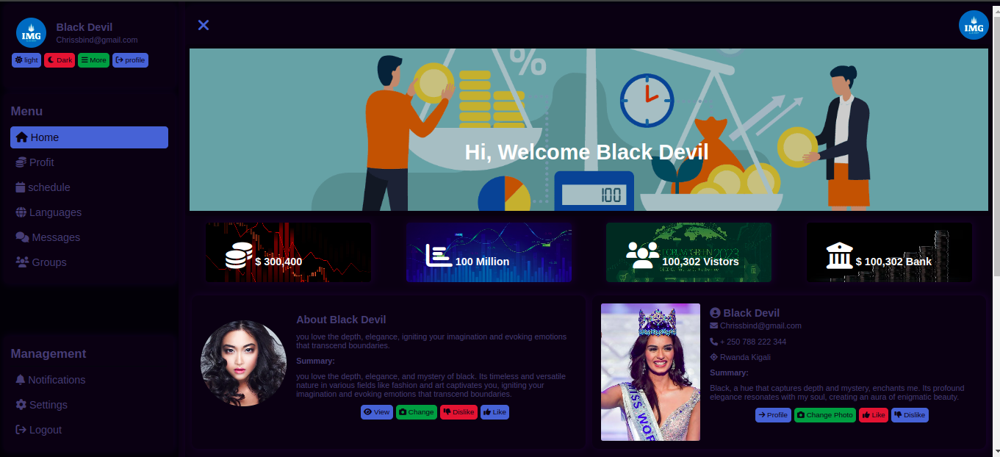
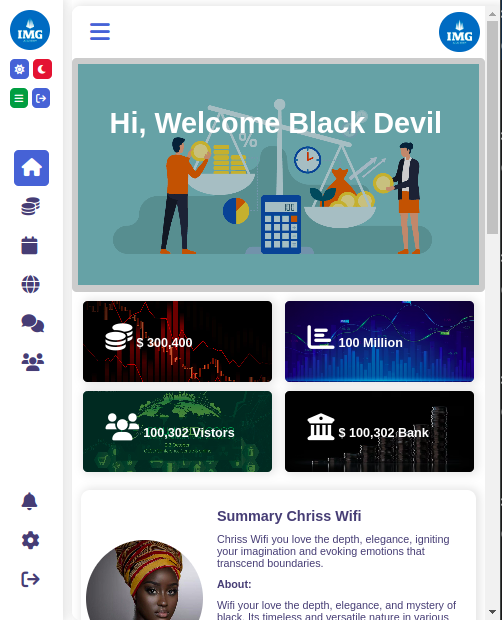
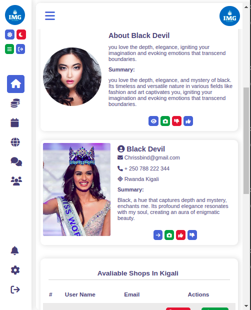
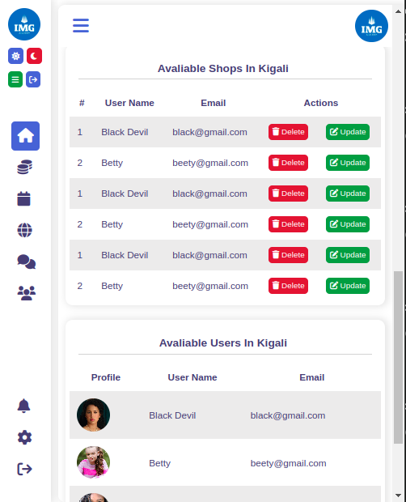

# Simple Social Dashboard

This single-page dashboard is a lightweight project showcasing a social dashboard built purely with HTML, CSS, and JavaScript. It includes features like a profile section, menus, images, and tables, providing a glimpse into a social platform's functionality.
Live Demo (https://lscblack.github.io/simple_social_dashboard_pure_html_css_js/)
## Screen Shots
### ** View One **

### ** View Two **

### ** View 3 light mode **

### ** View 3 dark mode **

### ** View 3 dark mode **

### ** View 3 Small Screen **

### ** View 3 Small Screen **

### ** View 3 Small Screen **

## Usage

1. Clone the repository:
   ```
   git clone https://github.com/lscblack/simple_social_dashboard_pure_html_css_js.git
   ```

2. Navigate to the project folder:
   ```
   cd simple_social_dashboard_pure_html_css_js
   ```

3. Open the `index.html` file in your preferred web browser.
   ```
   double-click on index.html
   ```

## Customization

Feel free to customize the dashboard according to your needs. The entire dashboard is contained within the HTML, CSS, and JavaScript files. Modify, add, or remove components to tailor it to your preferences.

## Features

- **Responsive Design:** The dashboard adapts to various screen sizes.
- **Dark and Light Modes:** Toggle between light and dark themes.
- **Animated Slide:** Elements slide in/out for an interactive experience.
- **Pure HTML/CSS/JS:** No external frameworks used for development.

## Footer

This project is open-source. Feel free to contribute or use it as a learning resource. For any suggestions or issues, please create an issue in this repository.

2023 All rights reserved by lscblack
## Author
LSC_BLACK(Loue Sauveur Christian)
## License

This repository is licensed under the **[MIT License](LICENSE)**.

# Thank you
    **Happy coding Enjoy **
